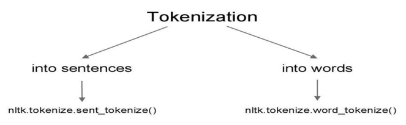
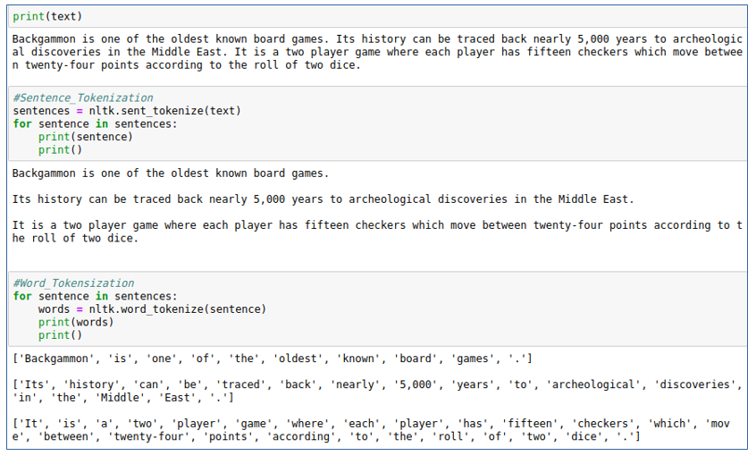
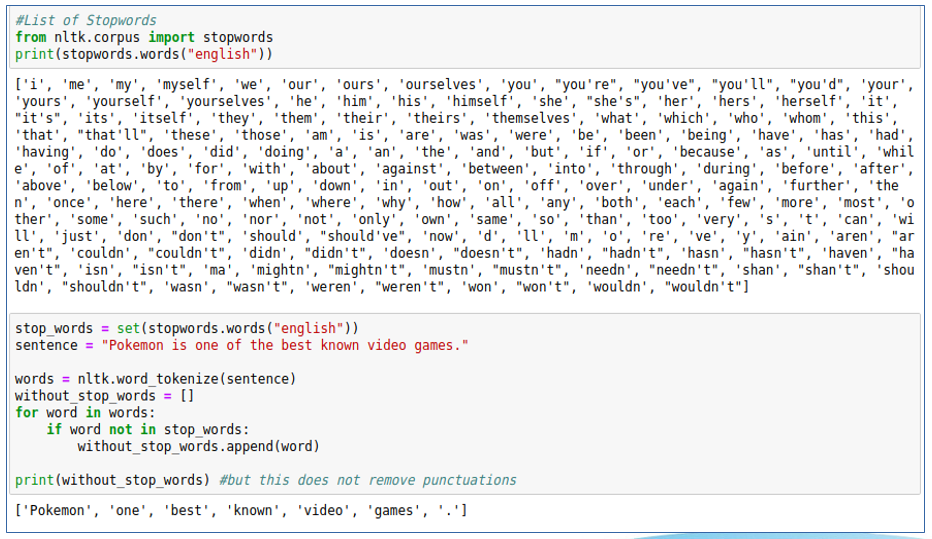
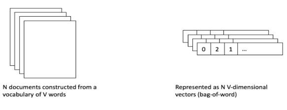
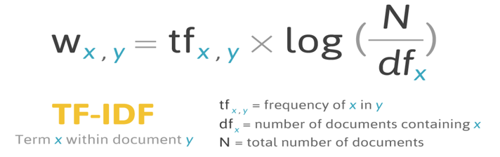
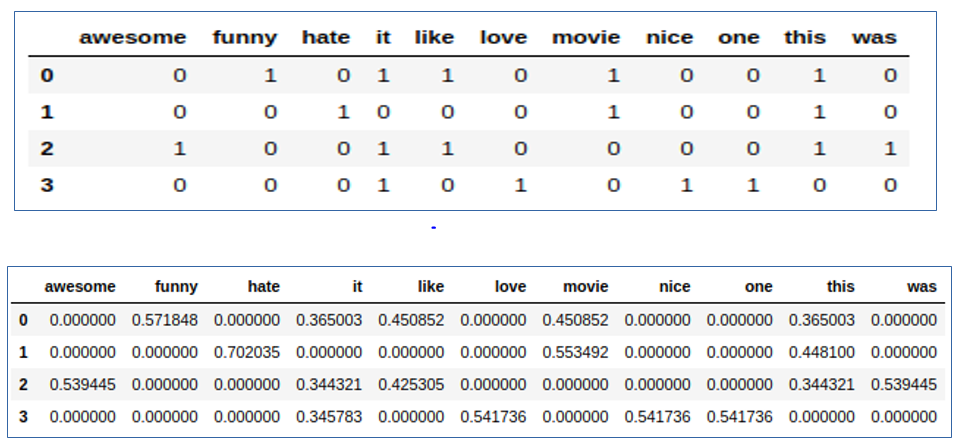
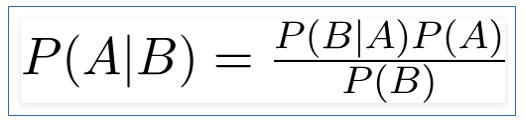
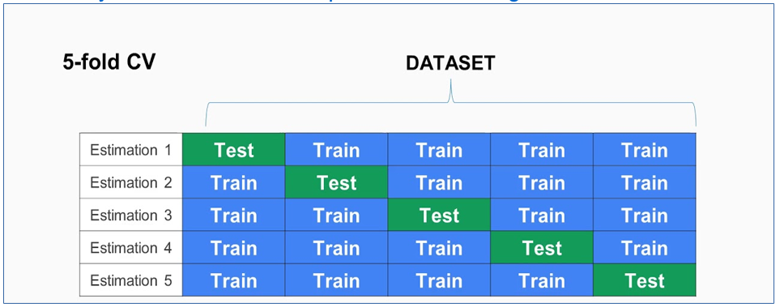

# Spam-Email Classifier 

Spam e-mail are message randomly sent to multiple addressees by all sorts of groups, by mostly lazy advertisers and criminals who wish to lead you to phishing sites.

Objective -
* To give knowledge to the user about the fake e-mails and relevant e-mails
* To classify that mail spam or not

# NLP Basic Algorithm's 

# Tokenization 

Tokenization is the process of breaking a stream of text up into words, symbols, or other meaningful elements called tokens.This tokens are then taken as an input for further data pre-proccessing

Types of tokenization - 

**Example code for Tokenization**

# Stemming and Lemmatization  

Lemmatization in linguistics, is the process of grouping together the different inflected forms of a word so they can be analysed as a single item.

Stemming is the process of producing morphological variants of a root/base word.For example stemming algorithm reduces the words “chocolates”, “chocolatey”, “choco” to the root word, “chocolate”.

# Stop-Words 

Stop Words are words which do not contain important significance to be used in Search Queries. Usually, these words are filtered out from search queries because they return a vast amount of unnecessary information. 

Each programming language will give its own list of stop words to use. Mostly they are words that are commonly used in the English language such as 'as, the, be, are' etc.

**Example code for Stop-Words**

# Text Vectorization 

Machine learning algorithms operate on a numeric feature space, expecting input as a two-dimensional array where rows are instances and columns are features. 

In order to perform machine learning on text, we need to transform our documents into vector representations such that we can apply numeric machine learning. This process is called feature extraction or more simply, vectorization, and is an essential first step toward language analysis.

* Bag of Words Model 
* TF-IDF Model 

## Bag of Words Model

This model is used to pre-process the text by converting it into a bag of words, which keeps a count of the total occurrences of most frequently used words.
This model can be visualized using a table, which contains the count of words corresponding to the word itself.

## TF-IDF Model

TFIDF stands for term frequency- inverse document frequency.
It measures weight of a word and the weight is a measure used to evaluate how important a word is to a document in a collection of documents.

**Comparing BoW and TF-IDF**

# Naive Bayes Classifier

A Naive Bayes classifier is a probabilistic machine learning model that’s used for classification task. The crux of the classifier is based on the Bayes theorem.

## Bayes-Theorem

## Types of Naive Bayes Classifier
* Multinomial Naive Bayes -
This is mostly used for document classification problem. The features/predictors used by the classifier are the frequency of the words present in the document. 

* Bernoulli Naive Bayes - 
The parameters that we use to predict the class variable take up only values yes or no, for example if a word occurs in the text or not.

* Gaussian Naive Bayes - When the predictors take up a continuous value and are not discrete, we assume that these values are sampled from a Gaussian distribution.

# K-fold cross validation

Cross Validation is a technique which involves reserving a particular sample of a dataset on which you do not train the model. Later, you test your model on this sample before finalizing it.

